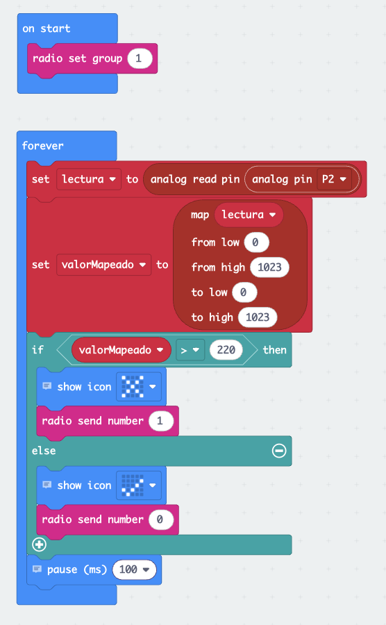
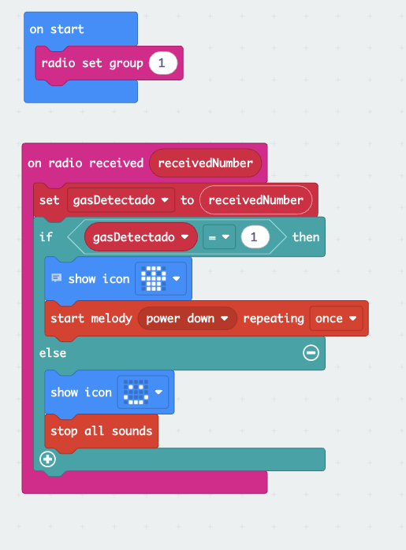

# IENSCH

---

# Detector de Humo con Micro:bit

Este proyecto es un **ejercicio educativo interactivo** diseñado para enseñar los 
fundamentos de la **programación con microcontroladores** utilizando la **BBC micro:bit**.  
Forma parte del **semillero tecnológico** y está orientado a estudiantes de grado 8° 
que desean aprender cómo los sensores pueden integrarse con la programación para 
resolver problemas de la vida real.

---

## 🎯 Funcionalidades principales

- 🔥 **Detección de humo/gas** mediante el sensor MQ-2.  
- 🚨 **Alarma sonora** con un buzzer al detectar humo.  
- 📊 **Lectura de valores analógicos** para calibrar la sensibilidad del sensor.  

---

## 🧪 ¿Qué aprenderán los estudiantes?

- Conectar y programar un **sensor externo** en la micro:bit.  
- Diferenciar entre **lectura digital (ON/OFF)** y **lectura analógica (valores continuos)**.  
- Usar **condicionales** para activar alarmas según un umbral definido.  
- La importancia de los **sensores en la seguridad** de hogares y espacios públicos.  

---

## ⚙️ ¿Cómo funciona?

1. El **sensor MQ-2** mide la concentración de humo o gas en el aire.  
2. La micro:bit lee el valor de salida del sensor.  
3. Si el valor es mayor al **umbral definido**:  
   - Se activa el buzzer con una alarma sonora. 
   - La micro:bit muestra un ícono de alerta 🚨 en su pantalla LED.  
4. Si no hay humo, el buzzer permanece apagado y se muestra un ícono de ✅ indicando seguridad.

---

## ⚠️ Advertencias

- El sensor MQ-2 **no entrega valores exactos**, solo indica una tendencia de concentración de humo/gas.  
- Para pruebas en clase, usar el **gas de un encendedor** (sin fuego), nunca acercar llamas directamente.  
- No usar este prototipo como sustituto de un **detector de humo certificado**.  
- Asegurarse de alimentar el sensor con el voltaje correcto (5V recomendado en la mayoría de módulos).  

---

## 🚀 Ideas para extender el ejercicio

- 📡 Enviar la señal de alarma a **otra micro:bit** mediante comunicación por radio.  
- 📲 Conectar la micro:bit a un teléfono móvil mediante **Bluetooth** para notificaciones.  
- 🔋 Implementar un sistema de **bajo consumo** con batería externa.  
- 🌎 Relacionar el proyecto con la importancia de la **prevención de incendios** en la vida real.  

---

## 👨🏻‍💻👩🏻‍💻 Desarrollo del proyecto

## Detector

### Código en Bloques:
  

### Código en JavaScript: 
```JavaScript
let lectura = 0
let valorMapeado = 0

radio.setGroup(1)

basic.forever(function () {
    lectura = pins.analogReadPin(AnalogPin.P2)
    valorMapeado = pins.map(lectura, 0, 1023, 0, 1023)

    if (valorMapeado > 220) {
        basic.showIcon(IconNames.No) // ❌
        radio.sendNumber(1)
    } else {
        basic.showIcon(IconNames.Yes) // ✔️
        radio.sendNumber(0)
    }

    basic.pause(100) // cada 0.1 s → 10 veces por segundo
})
```

## Alarma

### Código en Bloques:
  

### Código en JavaScript: 
```JavaScript
let gasDetectado = 0
radio.setGroup(1)

radio.onReceivedNumber(function (receivedNumber) {
    gasDetectado = receivedNumber
    if (gasDetectado == 1) {
        basic.showIcon(IconNames.Skull) // ☠️ o puedes usar otro icono
        music.startMelody(music.builtInMelody(Melodies.PowerDown), MelodyOptions.Once)
    } else {
        basic.showIcon(IconNames.Happy)
        music.stopAllSounds()
    }
})
```

---

## Licencia

Distribuido bajo la licencia MIT. Consulte la sección «LICENCIA» para más información.