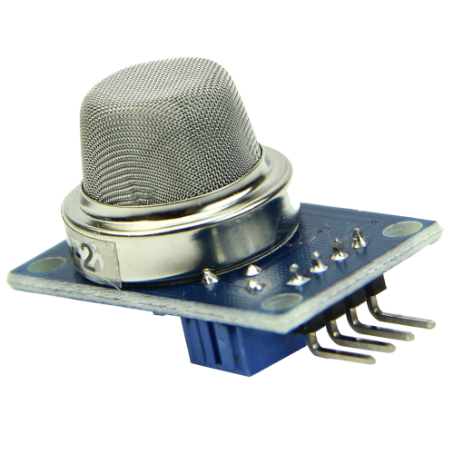
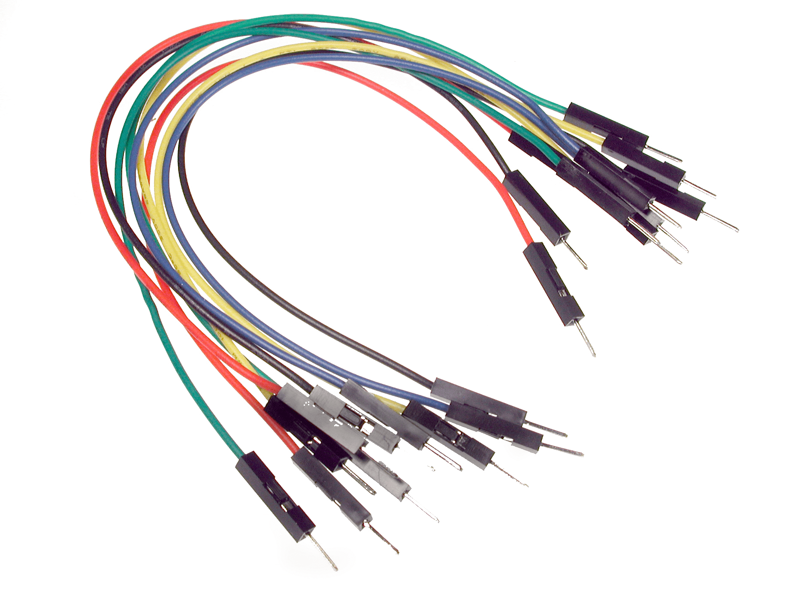
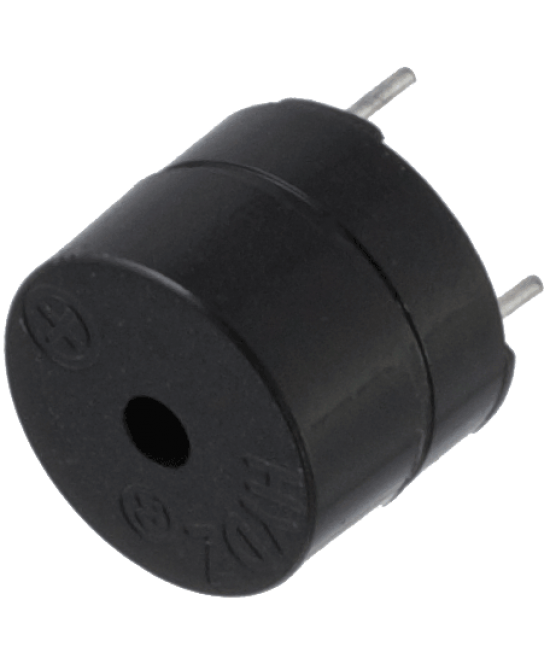
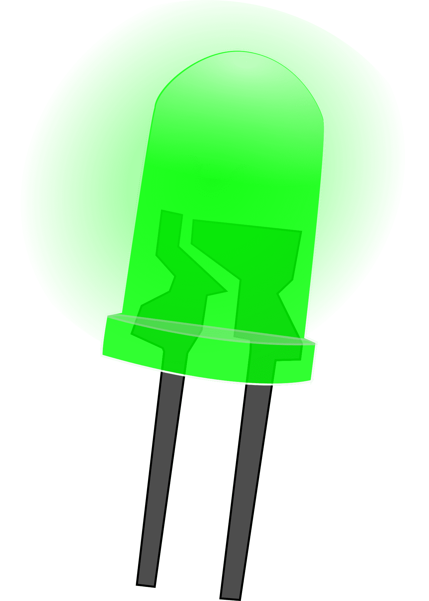
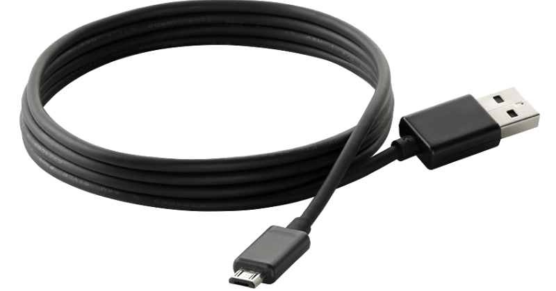
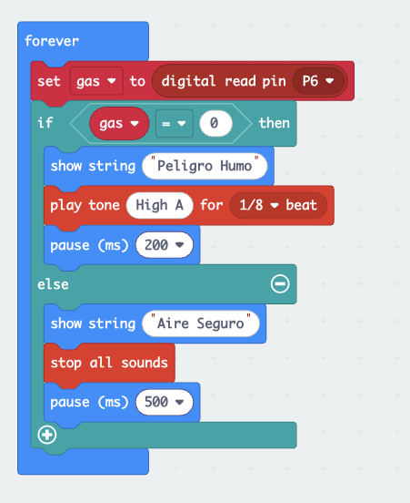
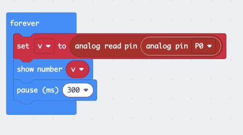
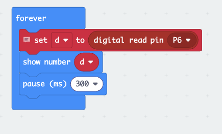

# IENSCH

---

# Detector de Humo con Micro:bit

Este proyecto es un **ejercicio educativo interactivo** diseñado para enseñar los 
fundamentos de la **programación con microcontroladores** utilizando la **BBC micro:bit**.  
Forma parte del **semillero tecnológico** y está orientado a estudiantes de grado 8° 
que desean aprender cómo los sensores pueden integrarse con la programación para 
resolver problemas de la vida real.

---

## 📌 Partes requeridas

- **BBC micro:bit**
  

- **Sensor de humo MQ-2**  
  

- **Protoboard**  
  

- **Jumpers (cables de conexión)**  
  

- **Zumbador (buzzer)**  
  

- **LED rojo (opcional)**  
  

  - **LED verde (opcional)**  
  

- **Fuente de energía (USB o batería 5V)**  
  

---

## 🎯 Funcionalidades principales

- 🔥 **Detección de humo/gas** mediante el sensor MQ-2.  
- 🚨 **Alarma sonora** con un buzzer al detectar humo.  
- 💡 **Indicador visual** en la matriz LED de la micro:bit y con LED externo (opcional).  
- 📊 **Lectura de valores analógicos** para calibrar la sensibilidad del sensor.  

---

## 🧪 ¿Qué aprenderán los estudiantes?

- Conectar y programar un **sensor externo** en la micro:bit.  
- Diferenciar entre **lectura digital (ON/OFF)** y **lectura analógica (valores continuos)**.  
- Usar **condicionales** para activar alarmas según un umbral definido.  
- Representar información en la **matriz LED** de la micro:bit.  
- La importancia de los **sensores en la seguridad** de hogares y espacios públicos.  

---

## ⚙️ ¿Cómo funciona?

1. El **sensor MQ-2** mide la concentración de humo o gas en el aire.  
2. La micro:bit lee el valor de salida del sensor.  
3. Si el valor es mayor al **umbral definido**:  
   - Se activa el buzzer con una alarma sonora.  
   - Se enciende el LED rojo (opcional).  
   - La micro:bit muestra un ícono de alerta 🚨 en su pantalla LED.  
4. Si no hay humo, el buzzer permanece apagado y se muestra un ícono de ✅ indicando seguridad.
   - Se enciende el LED verde (opcional).

---

## ⚠️ Advertencias

- El sensor MQ-2 **no entrega valores exactos**, solo indica una tendencia de concentración de humo/gas.  
- Para pruebas en clase, usar el **gas de un encendedor** (sin fuego), nunca acercar llamas directamente.  
- No usar este prototipo como sustituto de un **detector de humo certificado**.  
- Asegurarse de alimentar el sensor con el voltaje correcto (5V recomendado en la mayoría de módulos).  

---

## 🚀 Ideas para extender el ejercicio

- 📡 Enviar la señal de alarma a **otra micro:bit** mediante comunicación por radio.  
- 📲 Conectar la micro:bit a un teléfono móvil mediante **Bluetooth** para notificaciones.  
- 🔋 Implementar un sistema de **bajo consumo** con batería externa.  
- 🌎 Relacionar el proyecto con la importancia de la **prevención de incendios** en la vida real.  

---

## 👨🏻‍💻👩🏻‍💻 Desarrollo del proyecto

### Código en Bloques:
  

### Código en JavaScript:
```JavaScript
let gas = 0
basic.forever(function () {
    gas = pins.digitalReadPin(DigitalPin.P6)
    if (gas == 0) {
        basic.showString("Peligro Humo")
        music.playTone(880, music.beat(BeatFraction.Eighth))
        basic.pause(200)
    } else {
        basic.showString("Aire Seguro")
        music.stopAllSounds()
        basic.pause(500)
    }
})
```


### Código para probar el sensor MQ-2 en el pin analógico:
```JavaScript
basic.forever(function () {
    let v = pins.analogReadPin(AnalogPin.P0) // valor 0..1023
    basic.showNumber(v)
    basic.pause(300)
})

```
  

  ### Código para probar el sensor MQ-2 en el pin digital:
```JavaScript
let d = 0
basic.forever(function () {
    // lee el pin digital
    d = pins.digitalReadPin(DigitalPin.P6)
    basic.showNumber(d)
    basic.pause(300)
})


```
  

---

## Licencia

Distribuido bajo la licencia MIT. Consulte la sección «LICENCIA» para más información.